# Stroke prediction

Comparing multiple ML models on the problem of stroke prediction

### Dataset

[prosperchuks - Diabetes, Hypertension and Stroke Prediction](https://www.kaggle.com/datasets/prosperchuks/health-dataset/data)

```bash
kaggle datasets download prosperchuks/health-dataset -p <path_to_this_folder>/data
```

### Reference work

[prasadshingare - Diabetes, Hypertension and Stroke Prediction ](https://www.kaggle.com/code/prasadshingare/diabetes-hypertension-and-stroke-prediction)

### Project structure

* Data preprocessing - [preprocessing.ipynb](preprocessing.ipynb)
* Reference project results recreation - [reference_recreation.ipynb](reference_recreation.ipynb)
* Model creation and results - [main_model.ipynb](main_model.ipynb)
* Package requirements - [requirements.txt](requirements.txt)

## Theoretical basis

### Stroke prediction

A stroke is a serious and often sudden medical event that can occur when a blood vessel bursts in the brain or something blocks blood supply to a part of the brain. Predicting a stroke will happen is an important asset since a stroke can result in a permanent disability of the patient, or death. Early identification can allow earlier intervention and reduce the chance of a severe outcome.
The features present in the dataset, are all features commonly linked to stroke risk. An ML model could combine these values and estimate the likelihood a stroke could happen, and support risk assessment.

### Models

#### Logistic Regression

Logistic regression is a binary classifier that estimates the probability of belonging to one of two classes. The linear score is defined as:

$$
h = θ^T x + b
$$

The predicted probability is $P(y=1 \mid x)=\sigma(h)$, where $\sigma$ is the sigmoid function, $x$ is the input feature vector, $\theta$ is the learned weight vector, and $b$ is the bias term.

#### Decision tree

A decision tree recursively splits the data into smaller groups based on feature values. Each split tries to make the resulting subsets as homogeneous as possible with respect to the target value.
The quality of a split is measured using a criterion such as Gini impurity or entropy.

#### Random forest

Random forest is an ensemble of many decision trees trained on different bootstrap samples of the data. Each tree sees a random subset of features, and the final prediction is obtained by averaging the outputs of all trees or by majority voting.

#### KNN

K-nearest neighbors (KNN) is a distance-based classifier. To predict the target class of a new subject, the model finds the $k$ closest training examples and assigns the majority class among them. For Euclidean distance, this can be computed as:

$$
d(x, x_i) = \sqrt{\sum_{j=1}^{m}(x_j - x_{ij})^2}
$$

With uniform weights, the decision is based on the nearest neighbors of $x$:

$$
\hat{y}(x) = \text{mode}(y_1, y_2, \dots, y_k)
$$

#### Naive Bayes

Naive Bayes is a probabilistic classifier based on Bayes' theorem. It estimates the probability of a class given the observed features:

$$
P(y \mid x) = \frac{P(x \mid y)P(y)}{P(x)}
$$

The assumption is that all predictors are conditionally independent given the class label:

$$
P(y \mid x) \propto P(y) \prod_{j=1}^{m} P(x_j \mid y)
$$

#### SVM

Support Vector Machine (SVM) finds a decision boundary that maximizes the margin between classes. For data that is not linearly separable, an SVM can use a kernel function, such as the radial basis function (RBF), to represent nonlinear decision boundaries. For a soft-margin linear SVM, the optimization problem is:

$$
\min_{w,b,\xi} \frac{1}{2}\|w\|^2 + C \sum_{i=1}^{n} \xi_i
$$

subject to:

$$
y_i(w^T x_i + b) \ge 1 - \xi_i, \quad \xi_i \ge 0
$$

The parameter $C$ controls the trade-off between a wide margin and penalizing misclassifications.

#### XGBoost

XGBoost is an ensemble method based on gradient boosting and a fast implementation of gradient boosted trees. It builds many shallow decision trees sequentially, where each new tree tries to correct the errors of the previous ones. The model is trained by minimizing a loss function plus a regularization term:

$$
\sum_{i=1}^{m} L\left(y^{(i)}, H_{k-1}(x^{(i)}) + h_k(x^{(i)})\right) + \gamma J_k + \sum_{j=1}^{J_k} \left(\frac{\lambda}{2} x_j^2 + \alpha |x_j|\right)
$$

where $L$ is the loss function, $H_{k-1}(x^{(i)})$ is the previous model prediction, $h_k(x^{(i)})$ is the new weak learner added at step $k$, and the remaining terms represent the regularization applied to the model.

#### AdaBoost

AdaBoost is a boosting algorithm that combines many weak learners into a strong classifier. Each weak learner is assigned a weight based on how well it performs, and hard examples receive more attention in later iterations. The final classifier is a weighted sum of weak models:

$$
H_K(x) = \text{sign}\left(\sum_{k=1}^{K} \alpha_k h_k(x)\right)
$$

where $h_t(x)$ is the weak learner and $\alpha_t$ is its weight.

### Hyperparameter tuning

Hyperparameters are parameters that are not learned directly by the model but are set before training. Examples include the number of trees in a forest, the learning rate in boosting, the maximum depth of a tree, or the regularization parameter in logistic regression.

In this project, hyperparameter tuning was performed using grid search. Grid search evaluates a set of candidate values and selects the configuration that results in the best validation score.

### Model scoring

#### ROC-AUC

ROC-AUC measures how well a model distinguishes between positive and negative samples. It uses the Receiver Operating Characteristic curve, which plots the true positive rate against the false positive rate at different thresholds. A value of 0.5 corresponds to random guessing, while a value of 1.0 represents perfect discrimination.

#### F1 score

The F1 score combines precision and recall, making it useful when the positive class is less frequent than the negative class. It is defined as:

$$
F1 = 2 \cdot \frac{\text{Precision} \cdot \text{Recall}}{\text{Precision} + \text{Recall}}
$$

where:

$$
\text{Precision} = \frac{TP}{TP + FP}, \quad \text{Recall} = \frac{TP}{TP + FN}
$$

where $TP$, $TN$, $FP$, and $FN$ are true positives, true negatives, false positives, and false negatives.

#### Accuracy

Accuracy is the proportion of correctly classified samples:

$$
\text{Accuracy} = \frac{TP + TN}{TP + TN + FP + FN}
$$

where $TP$, $TN$, $FP$, and $FN$ are true positives, true negatives, false positives, and false negatives.

## Dataset analysis

The dataset consists of 11 columns and 49100 rows, with 10 predictors and one target variable.

* Sex, Hypertension, Heart disease, Ever married, Residence type, Smoking status, Stroke - Binary 0/1 values
* BMI, Average glucose level - Numerical values
* Work type - Categorical 0-4 values

<table border="1" class="dataframe">
  <thead>
    <tr style="text-align: left;">
      <th></th>
      <th>Missing</th>
      <th>Unique</th>
    </tr>
  </thead>
  <tbody>
    <tr>
      <th>sex</th>
      <td>3</td>
      <td>2</td>
    </tr>
    <tr>
      <th>age</th>
      <td>0</td>
      <td>111</td>
    </tr>
    <tr>
      <th>hypertension</th>
      <td>0</td>
      <td>2</td>
    </tr>
    <tr>
      <th>heart_disease</th>
      <td>0</td>
      <td>2</td>
    </tr>
    <tr>
      <th>ever_married</th>
      <td>0</td>
      <td>2</td>
    </tr>
    <tr>
      <th>work_type</th>
      <td>0</td>
      <td>5</td>
    </tr>
    <tr>
      <th>Residence_type</th>
      <td>0</td>
      <td>2</td>
    </tr>
    <tr>
      <th>avg_glucose_level</th>
      <td>0</td>
      <td>2903</td>
    </tr>
    <tr>
      <th>bmi</th>
      <td>0</td>
      <td>370</td>
    </tr>
    <tr>
      <th>smoking_status</th>
      <td>0</td>
      <td>2</td>
    </tr>
    <tr>
      <th>stroke</th>
      <td>0</td>
      <td>2</td>
    </tr>
  </tbody>
</table>

The target Stroke vector already had a mostly equal distribution, so no further processing was done.
1  -  20460
0   - 20450

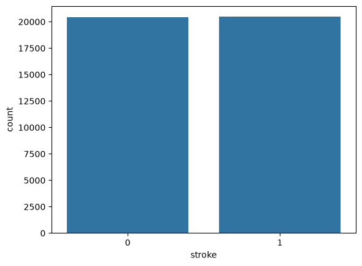\

Correlation matrix showed no columns with over a 0.3 correlation outside of the diagonal, and 12 columns with an absolute correlation over 0.2.
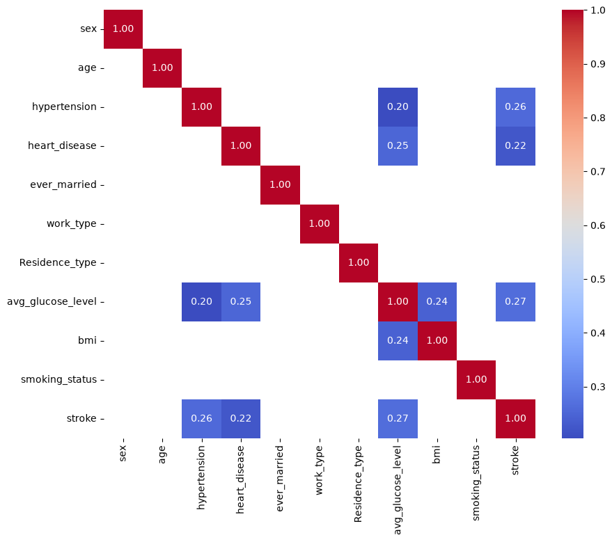

## Reference results reproduction

### Data preprocessing

The reference project removed all predictor columns with an absolute correlation with the stroke column under 0.2. Which kept the predictors as: Heart disease, Hypertension and Average glucose level.

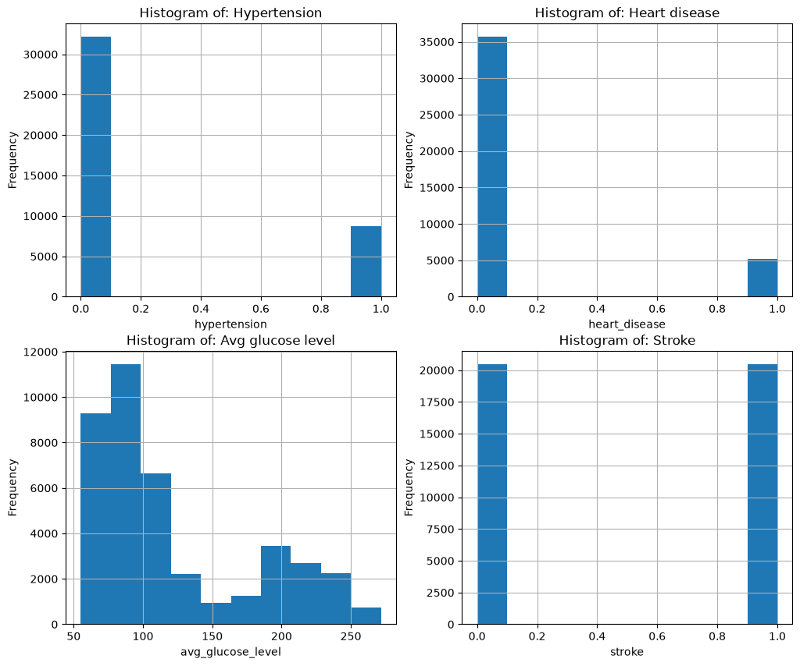

Dataset mean and standard deviation:
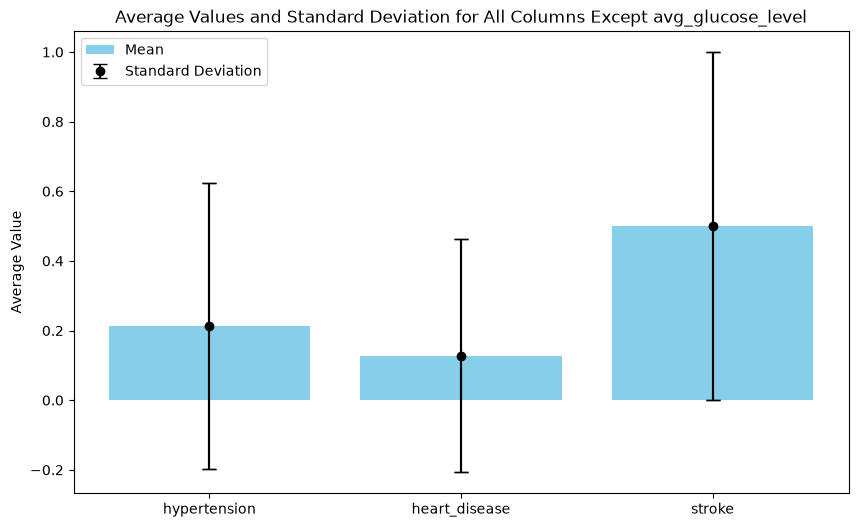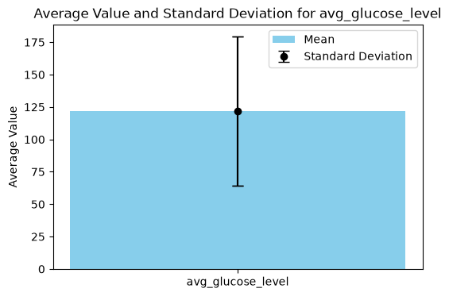

Histograms of predictors with target values shown:
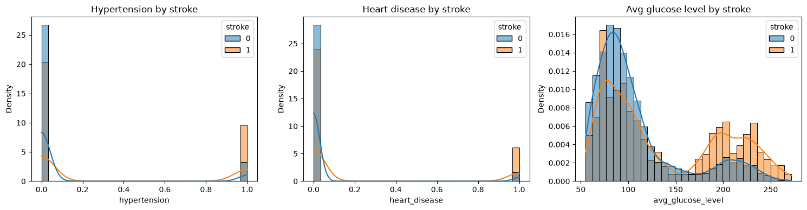

The dataset was split into a train and test set, as in the reference project, in a stratified 80-20 split:
	Total dataset size: 40910

	Training set size: 32728 (80.00%)

	Test set size: 8182 (20.00%)

The data was standardized using a standard scaler to make the model better at predicting and not skew the results.

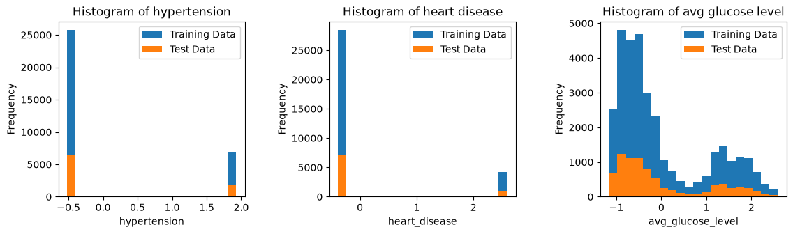

### Reference model creation and comparison

#### Logistic regression

A grid search was done with a stratified 10 fold, standardization and maximum iteration of 5000. The scoring was done with ROC-AUC:

| Parameter / Metric                  | Configuration / Search Space | Best Result           |
| :---------------------------------- | :--------------------------- | :-------------------- |
| **`log_reg__C`**            | `np.logspace(-3, 3, 15)`   | `7.196856730011514` |
| **`log_reg__solver`**       | `['lbfgs', 'liblinear']`   | `'liblinear'`       |
| **`log_reg__penalty`**      | `['l1', 'l2']`             | `'l2'`              |
| **`log_reg__class_weight`** | `[None, 'balanced']`       | `None`              |
| Best CV ROC-AUC                     | —                           | **`0.704`**   |

Results of the model with optimal hyperparameters:

* Test ROC-AUC: 0.698
* Test accuracy: 0.676

Reference results:

- Accuracy: 0.682
- Fl score: 0.681

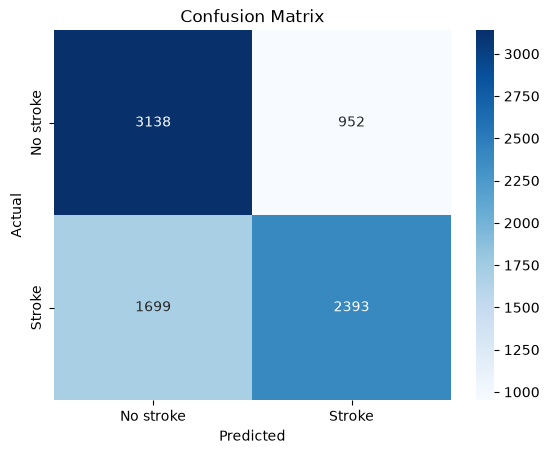

#### Decision tree

Results of the decision tree model:

* Test ROC-AUC: 0.999
* Test accuracy: 0.997

Reference results:

- Accuracy: 0.999
- Fl score: 0.999


#### Random forest

Results of the random forest model:

* Test ROC-AUC: 0.999
* Test accuracy: 0.997

Reference results:

- Accuracy: 0.997
- Fl score: 0.997


#### KNN

A grid search was done with a stratified 5 fold. The scoring was done with ROC-AUC:

| Parameter / Metric        | Configuration / Search Space        | Best Result     |
| :------------------------ | :---------------------------------- | :-------------- |
| **`n_neighbors`** | `[1, 2, 3, 4, 5, 6, 7, 8, 9, 10]` | `7`           |
| **`weights`**     | `['uniform', 'distance']`         | `'distance'`  |
| **`metric`**      | `['euclidean', 'manhattan']`      | `'euclidean'` |

Results of the KNN model with optimal hyperparameters:

* Test ROC-AUC: 0.998
* Test accuracy: 0.997

Reference results:

- Accuracy: 0.851
- Fl score: 0.849


### Discussion and result analysis

#### Results comparison

The results have similar values for all models except the K-nearest neighbor models. The slight differences in other model might come from the standardization of data when data preprocessing, or a slight difference in hyperparameters of the model.
The biggest difference occurs in the results of the KNN model, where the reference Kaggle notebook gets a test accuracy of 0.85. The model from this paper manages to get the same results as both the Random forest and the Decision tree model, and an accuracy of almost 0.997 on the test set. These differences are expected to be the result of a grid search for optimal parameters being done in this model creation, and being absent from the reference work.

#### Duplicates analysis

Three of the four models managed to get near perfect results, which leads to an analysis of whether the model is really predicting well or there is an issue in the dataset, preprocessing ot train-test splitting.
A possible contender for the reason of the perfect predictions is a test and train set sharing many duplicate predictor value combinations. When doing an analysis this was seen to be the case:

* Number of rows in test: 8182
* Number of test rows duplicated in train: 8177
* Percentage of test set: 99.94%

After the preprocessing was done, and columns with low correlation values were removed from the data, the reference work is left with a train set having 99.94% of rows that are already present in the training set. When removing the duplicate rows, the data is left with as little as 3033 rows, and a completely skewed target vector. This shows that this preprocessing is not adequate for working with this dataset, since removing duplicates ends up with a non-trainable dataset.

* Shape of the dataframe before removing duplicates: (40910, 4)
* Shape of the dataframe after removing duplicates: (3033, 4)

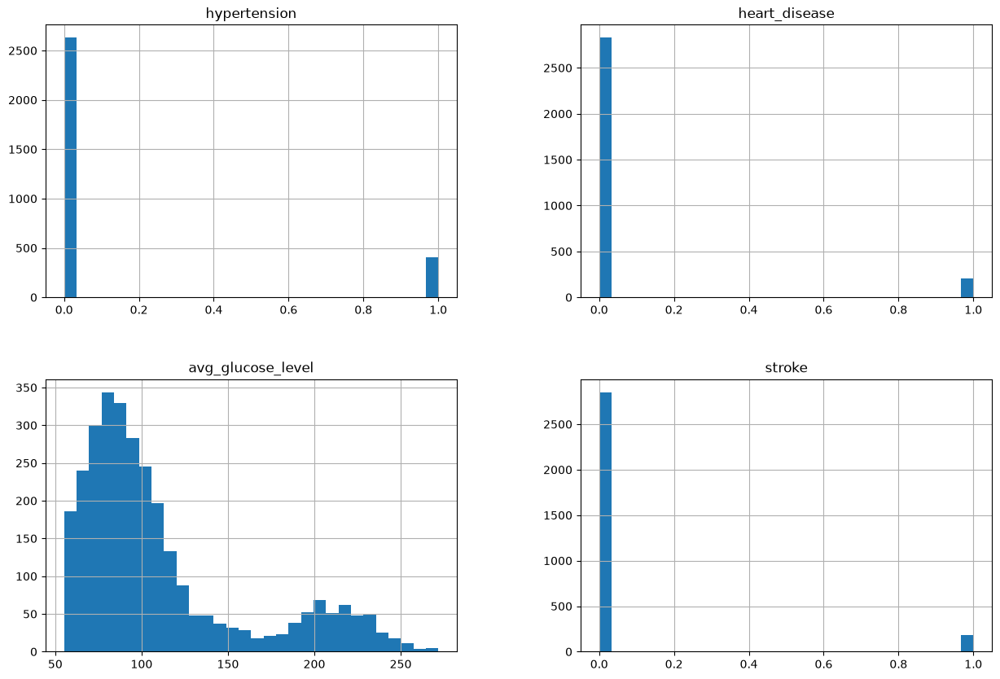

#### Analyzing the 23 outliers

The three models with the near-perfect predictions were all incorrectly predicting 23 rows with a stroke value of 1. An analysis is done to make sense of the bad predictions.
Inability to predict some values, may come as a result of the duplicates in the test and train set. If two rows would have the same predictor values but a different target value it would make it impossible for the model to precisely predict these values. The results showed there was such an issue in the data with 6,14% of rows being involved in conflicts:

* Number of distinct feature-sets with conflicting stroke labels: 21
* Number of rows involved in a conflict: 2512
* Percentage of dataset: 6.14%

The skewed values seemed to actually come mostly from the stroke values with a value of 1:

Stroke value counts among conflicting rows:
1    2378
0     134

All 23 incorrectly predicted values were seen to be a result of conflicting target values, as expected:

* Number of badly classified rows: 23
* Number of badly classified rows duplicated in train: 23
* Percentage of badly classified set: 100.00%

The histograms show that the incorrectly classified rows usually had no heart disease, no hypertension and a low average glucose value, which is expected to make it harder to predict since the available analysis suggests that these features are associated with the target:

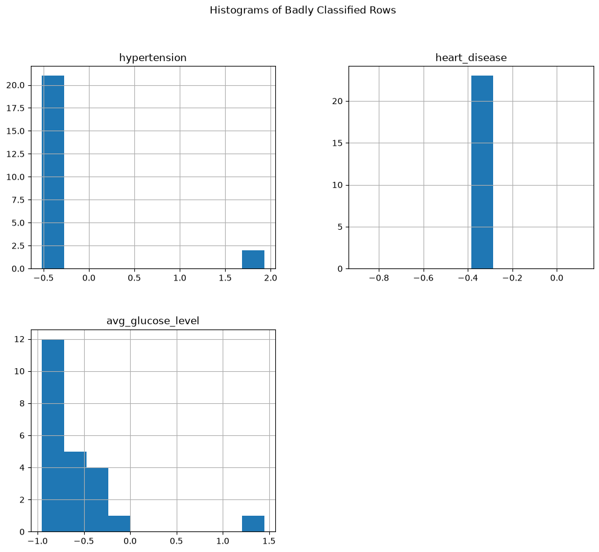

## New preprocessing and model creation

### Data preprocessing

To fix the issues of the reference data preprocessing, no predictors were left out.  Because of this the data contained no fully duplicate rows:

Shape of the dataframe before removing duplicates: (40910, 11)
Shape of the dataframe after removing duplicates: (40910, 11)

The three rows with a missing value for the sex column were removed. The histograms showed values were present for age that were below 0, which also needed to be removed:

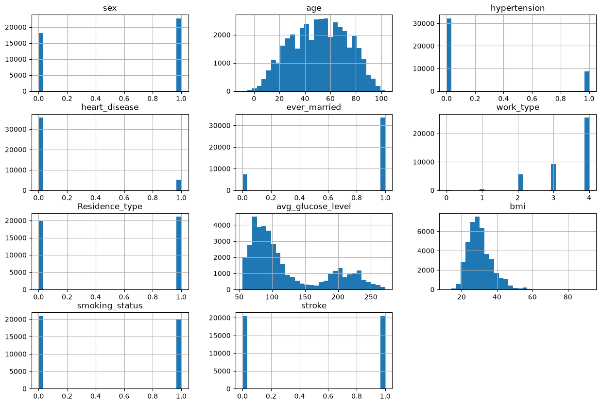

Number of rows with negative age removed: 58
Number of rows left in the dataframe: 40849

A pair-plot was created but no obvious patterns for the stroke value were determined:

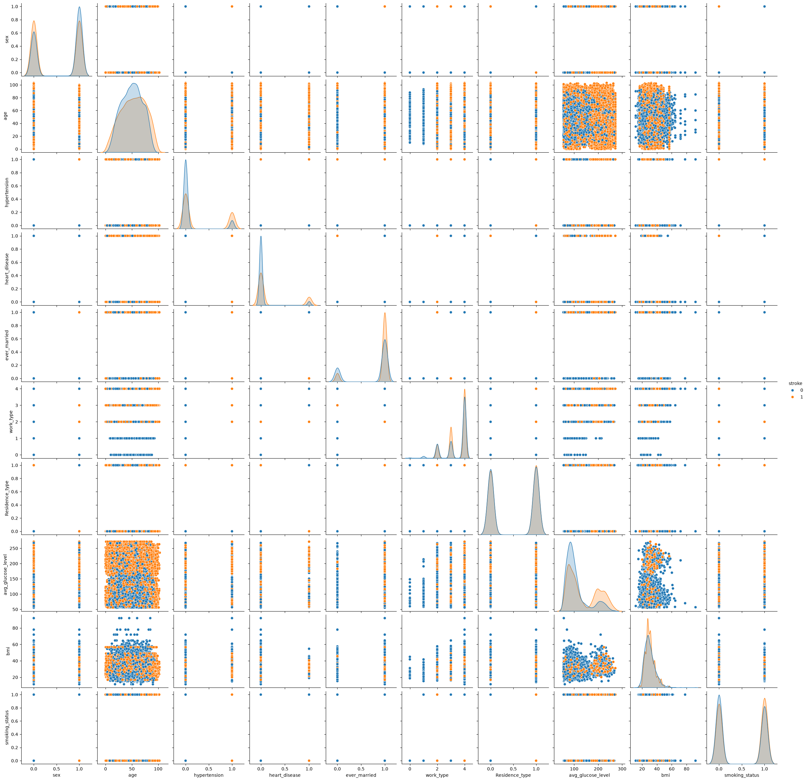

After the analysis the data was again split in an 80-20 split into a train and test set, with stratification enabled. The predictors were then standardized using a standard scaler, and the work type column was processed as a categorical column with values from 0 to 4:

Processed training shape: (32681, 14)
Processed test shape: (8171, 14)

#### Logistic regression

A grid search was done with a stratified 10 fold, standardization and maximum iteration of 5000. The scoring was done with ROC-AUC:

| Parameter / Metric                      | Configuration / Search Space | Best Result            |
| :-------------------------------------- | :--------------------------- | :--------------------- |
| **`log_reg__C`**                | `np.logspace(-3, 3, 15)`   | `0.3727593720314938` |
| **`log_reg__solver`**           | `['lbfgs', 'liblinear']`   | `'lbfgs'`            |
| **`log_reg__penalty`**          | `['l1', 'l2']`             | `'l2'`               |
| **`log_reg__class_weight`**     | `[None, 'balanced']`       | `'balanced'`         |
| **Best Cross-Validation ROC-AUC** | /                            | **`0.750`**    |

Results of the model with optimal hyperparameters:

* Test ROC-AUC: 0.765
* Test accuracy: 0.701

Earlier results:

* Test ROC-AUC: 0.698
* Test accuracy: 0.676

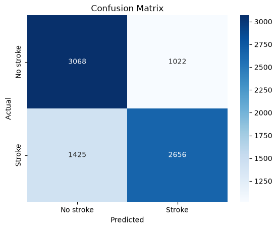

#### Decision tree

Results of the model with optimal hyperparameters:

* Test ROC-AUC: 1.0
* Test accuracy: 1.0

Earlier results:

* Test ROC-AUC: 0.999
* Test accuracy: 0.997


#### Random Forest

Results of the model with optimal hyperparameters:

* Test ROC-AUC: 0.999
* Test accuracy: 0.998

Earlier results:

* Test ROC-AUC: 0.999
* Test accuracy: 0.997

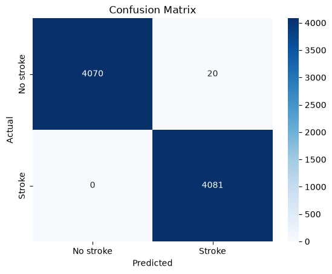

#### KNN

A grid search was done with a stratified 10 fold and standardization. The scoring was done with ROC-AUC:

| Parameter / Metric                      | Configuration / Search Space             | Best Result         |
| :-------------------------------------- | :--------------------------------------- | :------------------ |
| **`model__n_neighbors`**        | `[3, 5, 7, 9, 11, 13, 15, 17, 19, 21]` | `11`              |
| **`model__weights`**            | `['uniform', 'distance']`              | `'distance'`      |
| **`model__metric`**             | `['euclidean', 'manhattan']`           | `'manhattan'`     |
| **Best Cross-Validation ROC-AUC** | /                                        | **`0.980`** |

Results of the model with optimal hyperparameters:

* Test ROC-AUC: 0.983
* Test accuracy: 0.898

Earlier results:

* Test ROC-AUC: 0.998
* Test accuracy: 0.997

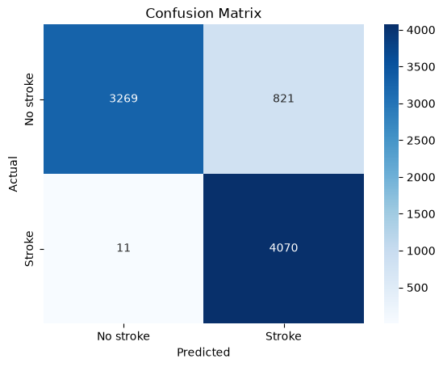

#### Naive Bayes

A grid search was done with a stratified 10 fold and standardization. The scoring was done with ROC-AUC:

| Parameter / Metric                      | Configuration / Search Space | Best Result            |
| :-------------------------------------- | :--------------------------- | :--------------------- |
| **`model__var_smoothing`**      | `np.logspace(-12, -6, 13)` | `1e-06`              |
| **Best Cross-Validation ROC-AUC** | /                            | **`0.747311`** |

Results of the model with optimal hyperparameters:

* Test ROC-AUC: 0.762
* Test accuracy: 0.684

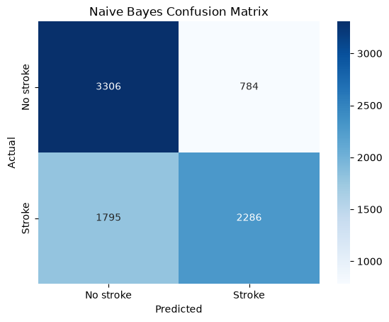

#### SVM

A grid search was done with a stratified 10 fold and standardization. The scoring was done with ROC-AUC:

| Parameter / Metric                      | Configuration / Search Space       | Best Result            |
| :-------------------------------------- | :--------------------------------- | :--------------------- |
| **`model__C`**                  | `[0.1, 1, 10, 100]`              | `100`                |
| **`model__gamma`**              | `['scale', 'auto', 0.001, 0.01]` | `'scale'`            |
| **`model__kernel`**             | `['rbf', 'linear']`              | `'rbf'`              |
| **`model__class_weight`**       | `[None, 'balanced']`             | `None`               |
| **Best Cross-Validation ROC-AUC** | /                                  | **`0.910350`** |

Results of the model with optimal hyperparameters:

* Test ROC-AUC: 0.912
* Test accuracy: 0.845

#### XGBoost

A grid search was done with a stratified 10 fold and standardization. The scoring was done with ROC-AUC:

| Parameter / Metric                      | Configuration / Search Space                         | Best Result            |
| :-------------------------------------- | :--------------------------------------------------- | :--------------------- |
| **`model__n_estimators`**       | `[100, 200, 400]`                                  | `400`                |
| **`model__max_depth`**          | `[3, 4, 6]`                                        | `6`                  |
| **`model__learning_rate`**      | `[0.01, 0.05, 0.1]`                                | `0.1`                |
| **`model__subsample`**          | `[0.8, 1.0]`                                       | `0.8`                |
| **`model__scale_pos_weight`**   | `[1, (y_train == 0).sum() / (y_train == 1).sum()]` | `1.0023895594632681` |
| **Best Cross-Validation ROC-AUC** | /                                                    | **`0.999999`** |

Results of the model with optimal hyperparameters:

* Test ROC-AUC: 1.0
* Test accuracy: 0.999


#### AdaBoost

A grid search was done with a stratified 10 fold and standardization. The scoring was done with ROC-AUC:

| Parameter / Metric                      | Configuration / Search Space         | Best Result            |
| :-------------------------------------- | :----------------------------------- | :--------------------- |
| **`model__n_estimators`**       | `[50, 100, 200, 400, 600]`         | `600`                |
| **`model__learning_rate`**      | `[0.01, 0.05, 0.1, 0.5, 0.7, 1.0]` | `1.0`                |
| **Best Cross-Validation ROC-AUC** | /                                    | **`0.781603`** |

Results of the model with optimal hyperparameters:

* Test ROC-AUC: 0.794
* Test accuracy: 0.708


### Discussion and result analysis

#### Comparison of different models and earlier results

| Model               | Earlier Test ROC-AUC | Earlier Test Accuracy | New Test ROC-AUC | New Test Accuracy |
| ------------------- | -------------------: | --------------------: | ---------------: | ----------------: |
| Logistic Regression |                0.698 |                 0.676 |            0.765 |             0.701 |
| Decision Tree       |                0.999 |                 0.997 |            1.000 |             1.000 |
| Random Forest       |                0.999 |                 0.997 |            0.999 |             0.998 |
| KNN                 |                0.998 |                 0.997 |            0.983 |             0.898 |
| Naive Bayes         |                    / |                     / |            0.762 |             0.684 |
| SVM                 |                    / |                     / |            0.912 |             0.845 |
| XGBoost             |                    / |                     / |            1.000 |             0.999 |
| AdaBoost            |                    / |                     / |            0.794 |             0.708 |

With a different form of preprocessing and all predictors kept, three of the four base models manage to achieve even better results. This shows that correlation with the target vector does not fully explain how the target vector achieves its values. To fully understand the issue, a deeper set of predictors is needed.
The Logistic regression model improvement suggests that keeping the other predictors allowed the model to make a better decision boundary.
The Decision tree and Random forest again achieve perfect or near perfect results. These results do not prove a data leakage was fully fixed, but fixing the duplicates and conflicts managed to help the models differentiate the 23 outliers better. The Decision tree managed to get an ideal score of 1, which suggests the dataset is highly separable when the data leakage is fixed.
The KNN model shows a drop in prediction accuracy, which is expected as the KNN method is highly sensitive to class overlap. Choosing a different set of hyperparameters, with a bigger grid search, might have been able to fix the issue.

Predictions were also done with four new models: Naive Bayes, SVM, XGBoost and AdaBoost.
Naive Bayes shows the weakest results. A possible explanation is the fact that NB expects uncorrelated and conditionally independent predictors. In the dataset analysis slight correlation has been shown to exist between the individual predictors, so the model is expected to not be suitable for this problem.
SVM manages to get better results than the LR and NB models, and with an accuracy score of 0.845 suggets that a non-linear separability may exist and can be captured in the dataset.
The XGBoost method is especially good with working with tabular data. Like the Decision tree and Random forest it also manages to get a near-perfect accuracy, with only three rows incorrectly classified.
AdaBoost results are only slightly better than the Logistic regression model. It shows that it is a weaker match for the dataset than the XGBoost method, which is expected since it is unable to model some of the richer feature interactions.

#### Future work

The results of this project can be further compared with results on a bigger or different dataset to make sure the data leakage is not the reason for the near-perfect results of some models.
Better results could be achieved with a broader grid search or a more in-depth analysis and preprocessing of the dataset itself.
For future work, the same process could be done on the other two datasets from the dataset group and analyze more deeply how the models perform.
